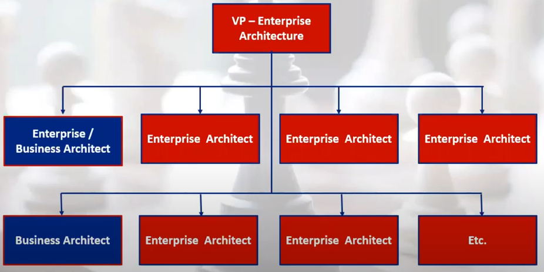

# 7 Tips to Improve Business Architecture Practice

By Daniel Lambert \(IRIS\), [link](https://youtu.be/NPG_0zQLRPk)

## 1. How to Find a Top Management Sponsor?

* Craft a Good Elevator Pitch
* Dare Talk about Money

What's the Good Sponsor?

* Ideally, it's the COO of your organization or one of its business unit \(need to be driven top-down\)
* A CIO can do if the person is business strategic oriented
* A good sponsor will help you open doors within the organization
* A good sponsor will follow-up with you at regular intervals
* A good sponsor will expect results rapidly.

Components of a Good Elevator Pitich:

1. Find a problem that's nagging your sponsor
   * Examples:
     * Projects are always delivered late
     * Delivered projects are not strategic enough
     * Our competitors have a better product offering
     * Promised synergies of an acquisition are not happening
   * Odds are high that you'll find a pertinent project in the organization annual report
2. Describe what you can do
   * Do not talk about capabilities, value streams, applications and stakeholders
   * Focus instead on the following:
     * Increasing Business Strategy Execution
     * Fixing Priorities
     * Eliminating Silos
     * Simplifying Complexity
     * Lowering Risk in the Delivery of Projects
     * etc.
3. Outline how much your practice would cost
   * Provide a number that you can beat
   * Do not hire too many architects at once
   * Do not talk about details \(but be prepared\)
4. Elaborate on what you'll generate or save
   * Outline briefly how much the tackled problem or initiative will generate or save
   * Do not talk about details \(but be prepared\)
   * Make sure that this number is much higher than the cost to implement your practice

## 2. How to Build Your Team?

### Quality 1: Customer Driven

### Quality 2: Excel at Finding Value

### Quality 3: Good Communications

### Quality 4: Not an Enterprise & Business Architecture Model Freak

### Quality 5: Know Measurement Techniques Inside Out

### Quality 6: Meeting the Organization's Objectives

## 3. How to Get Buy-In from you EcoSystem?

## 4. How to Integrate Business Architecture withing your Current Enterprise Architecture?

## 5. How to Schedule and Deliver your Roadmap to your First Success?

## 6. How to Calculate your Return-on-Investment after the Completion of your First Mandate, and Finally?

## 7. How to Grow and have a Greater Impact on your Organization?

