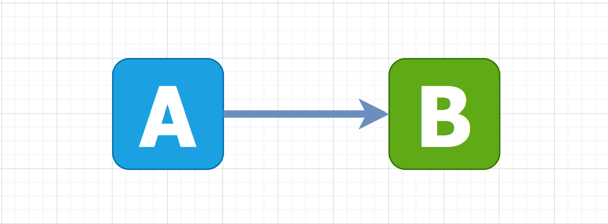
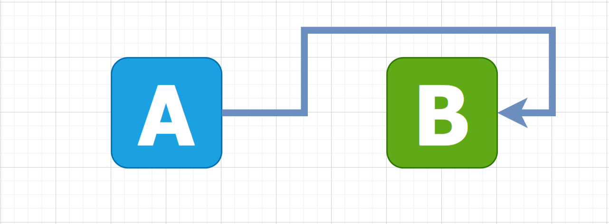
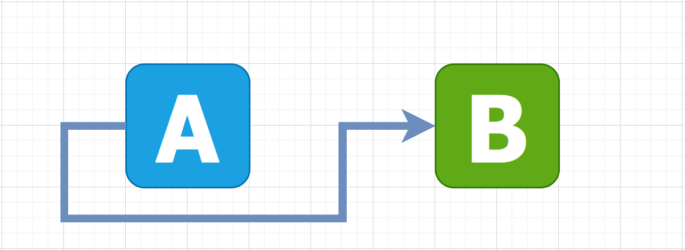
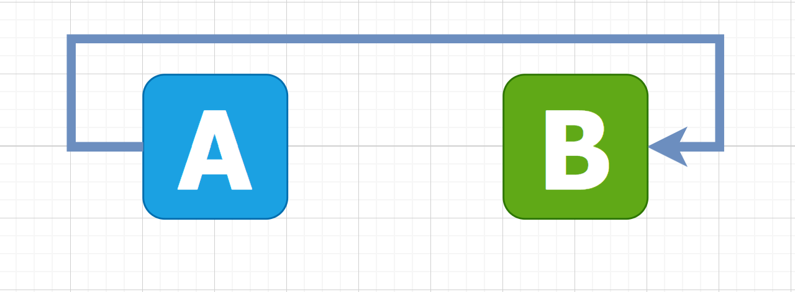
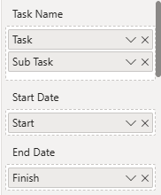
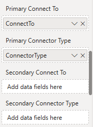
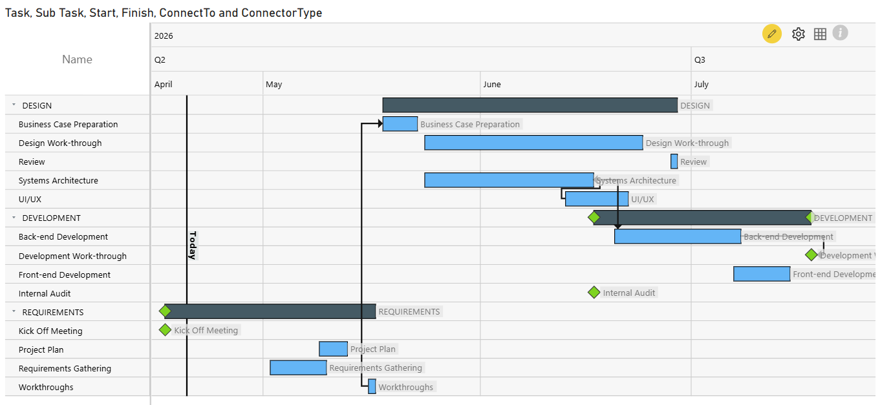

# Set Task Dependency in xViz Gantt Chart Visual

- [Set Task Dependency in xViz Gantt Chart Visual](#set-task-dependency-in-xviz-gantt-chart-visual)
  - [Definition of Task Dependency](#definition-of-task-dependency)
  - [Meaning of `predecessor` \& `successor`](#meaning-of-predecessor--successor)
  - [Types of Dependencies](#types-of-dependencies)
  - [Ways of Tasks Relating to Each Other](#ways-of-tasks-relating-to-each-other)
    - [1. Finish-to-Start (FS)](#1-finish-to-start-fs)
    - [2. Finish-to-Finish (FF)](#2-finish-to-finish-ff)
    - [3. Start-to-Start (SS)](#3-start-to-start-ss)
    - [4. Start-to-Finish (SF)](#4-start-to-finish-sf)
  - [Visualize Task Dependencies in xViz Gantt Chart for Power BI](#visualize-task-dependencies-in-xviz-gantt-chart-for-power-bi)
    - [Fields Definition](#fields-definition)
    - [Sample Project](#sample-project)
    - [Field Setting in Power BI Visual](#field-setting-in-power-bi-visual)

This article is based on the online post
1. https://blog.ganttpro.com/en/project-and-task-dependency-types-with-gantt-chart/
2. https://xviz.com/blogs/visualise-task-dependencies-in-xviz-gantt-chart-for-power-bi/

## Definition of Task Dependency

A **Task Dependency** (in a Gantt Chart) is a relationship that requires a particular order for tasks to be performed. It means that one preceding task relies on the other succeeding one.

The predecessor task defines the start or finish date of its successor task. When you create the dependency line between several tasks, you always start with the predecessor.

## Meaning of `predecessor` & `successor`

A `predecessor` is an activity whose start to finish controls the start or finish of another activity.

A `successor` is an activity whose start or finish is controlled by the start or finish of another activity.

*The role of `predecessors` and `successors` in project management is critical. Before you choose relationship types, you first need to identify `predecessors` in a project and also `successors`.*

## Types of Dependencies

Refer to [PMI](https://www.pmi.org/) and other reputable sources, there're 4 types of task dependencies may exist within one workflow:

- **Mandatory Dependencies** are legally or contractually required within the project's statement of work. They are also called hard logic dependencies.
- **Discretionary Dependencies** (soft logic) are not mandatory. However, the scheduling of activities may be influenced by team preferences, best practices, or conventions.
- **Internal Dependencies** establish relations between different activities within the project.
- **External Dependencies** describe an input from an external source that is required before a task can proceed.

## Ways of Tasks Relating to Each Other

In project management, there're four ways tasks can relate to each other.

### 1. Finish-to-Start (FS)

This type of dependency means that `Action A` should be completed to give a start to `Action B`. This is a natural kind of project management connection; therefore, it is recommended to use FS wherever possible.

Example: We cannot start digging a pit (B) without buying a spade (A). (没有铁锹 (A)，我们就无法开始挖坑 (B)。)

### 2. Finish-to-Finish (FF)

Finish-to-Finish relationship means that `task B` can only finish when `task A` (its predecessor) has also ended.

Example: We cannot finish reading a book (B) before reading the last chapter (A).

### 3. Start-to-Start (SS)

In Start-to-Start dependency, the successor can only start once the predecessor task it's dependent on has begun.

Example: We can't start managing a `project (B)` after we've prepared a solid `project plan (A)`.

### 4. Start-to-Finish (SF)

Start-to-Finish is the relationship, where the finish of the successor task is controlled by the start of the predecessor. Start-to-Finish is seldom used, and generally, it is recommended to avoid this task relationship.

Example: A new shift starts working `(A)` at a factory after the previous one has finished `(B)`.

## Visualize Task Dependencies in xViz Gantt Chart for Power BI

### Fields Definition

To plot the connectors in the visualization, following two information need to be provided:

- **"Connect To**: specifies the task that the current task must be connected to represent the dependency between the two tasks
- **"Connector Type**: specifies the direction of the dependency between the tasks.

Follow above terminology from project management practice, the acceptable values for the "Connector Type" field are combinations of the words "Start" and "Finish" denoting the position of the connector line in source and destination bars:

| Value | Description | Use Case |
| --- | --- | --- |
| FinishStart | The finish of the source task drives the start of the dependent task | `UI development` (dependent) can start only after the completion of the `UI/UX designing` (source) |
| FinishFinish | The finish of the source task drives the finish of the dependent task | Completion of `UI/UX review` (source) allows the completion of `UI development` (dependenct) |
| StartStart | Start of the source task is connected to the start of the dependent task | `UI/UX designing` (dependent) cannot start without `Requirements Gathering` (source) starting |
| StartFinish | Start of the source task is connected to the end of the dependent task | Start of `QA Testing` marks the end of `Development` activities |

### Sample Project

Below is the example of a dataset to plot the Gantt timeline of a software development project.

The project is divided into 3 broad tasks: "Requirements, Design and Development" and each task is broken into various subtasks. There're some dependencies within these subtasks, e.g. subtask "Business Case Preparation" cannot start before "Workthrough" starts.

Similarly, there're total 4 dependencies defined in this dataset from Weorkthrough, Systems Architecture, UI/UX, and Back-end Development subtasks with different connector type to specify the direction of the connector.

| Task         | Sub Task                  | Start     | Finish    | ConnectorType | ConnectTo                 |
| ------------ | ------------------------- | --------- | --------- | ------------- | ------------------------- |
| REQUIREMENTS | Kick Off Meeting          | 4/17/2026 | 4/17/2026 |               |                           |
| REQUIREMENTS | Requirements Gathering    | 5/2/2026  | 5/10/2026 |               |                           |
| REQUIREMENTS | Project Plan              | 5/9/2026  | 5/13/2026 |               |                           |
| REQUIREMENTS | Workthroughs              | 5/16/2026 | 5/17/2026 | StartStart    | Business Case Preparation |
| DESIGN       | Business Case Preparation | 5/18/2026 | 5/23/2026 |               |                           |
| DESIGN       | Systems Architecture      | 5/24/2026 | 6/17/2026 | FinishStart   | Back-end Development      |
| DESIGN       | UI/UX                     | 6/13/2026 | 6/22/2026 | StartFinish   | System Architecture       |
| DESIGN       | Design Work-through       | 5/24/2026 | 6/24/2026 |               |                           |
| DESIGN       | Review                    | 6/28/2026 | 6/29/2026 |               |                           |
| DEVELOPMENT  | Internal Audit            | 6/17/2026 | 6/17/2026 |               |                           |
| DEVELOPMENT  | Back-end Development      | 6/20/2026 | 7/8/2026  | FinishFinish  | Development Work-through  |
| DEVELOPMENT  | Front-end Development     | 7/7/2026  | 7/15/2026 |               |                           |
| DEVELOPMENT  | Development Work-through  | 7/18/2026 | 7/18/2026 |               |                           |

### Field Setting in Power BI Visual

The columns must be inserted in the data fields as shown below:

| Data Fields for Basic Gantt View | Data Fields for Connectors |
| --- | --- |
|  |  |

- `Task` and `Sub Task` columns will define the hierarchical structure of the category.
- `Start` and `Finish` columns will provide the start and finish dates for the timeline bars
- `ConnectorType` and `ConnectTo` define the properties of the connector lines.

Here is the output of the sample project in Power BI:

