# How-To Switch Java JDK from Oracle to OpenJDK

- [How-To Switch Java JDK from Oracle to OpenJDK](#how-to-switch-java-jdk-from-oracle-to-openjdk)
  - [Background](#background)
  - [Dependencies Analysis](#dependencies-analysis)
    - [Multiple JDK Versions Co-Existed](#multiple-jdk-versions-co-existed)
    - [Usage of Java JDK from Essential Tool](#usage-of-java-jdk-from-essential-tool)

## Background

In the Essential open source edition's installation page (https://enterprise-architecture.org/products/essential-open-source/essential-os-download/), as below, the required JRE is still version 1.8.

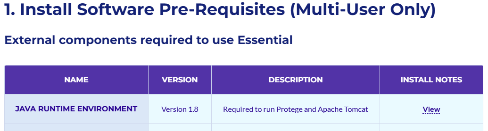

When clicking the `View` link, it opens https://www.java.com/en/download/help/index_installing.html, which is Oracle JRE site:

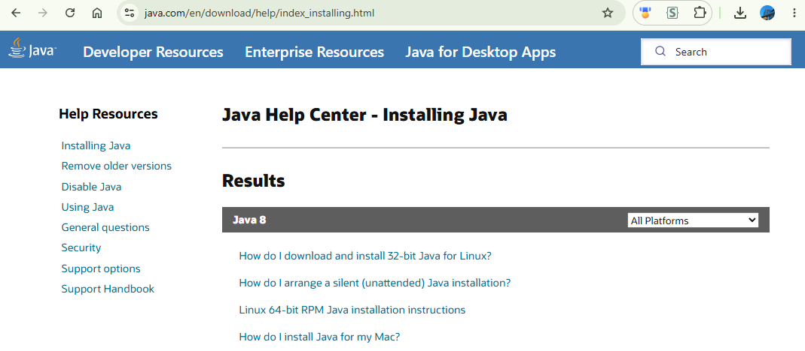

However, this is the non-compliant version which is not recommended from my company side, it is required to replace it with RedHat OpenJDK.

## Dependencies Analysis

As the JRE is required to run both Protege and Apache Tomcat, below analyze the dependencies in the Windows 11 computer.

### Multiple JDK Versions Co-Existed

The complexity in the machine I'm running is I already have higher Java version from OpenJDK for some other applications.

In command terminal, the Java version is by default point to the JDK21, as below:

```bash
C:\>java -version
openjdk version "21.0.5" 2024-10-15 LTS
OpenJDK Runtime Environment Microsoft-10377968 (build 21.0.5+11-LTS)
OpenJDK 64-Bit Server VM Microsoft-10377968 (build 21.0.5+11-LTS, mixed mode, sharing)
```

This is because the JDK21 is configured in `JAVA_HOME` system variable, as below:

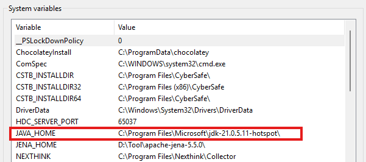

The Oracle JRE 1.8.0 - downloaded from the link (java.com) Essential appinted - is installed separagely and set in the System `Path`, so I can have both versions mixed in the machine:

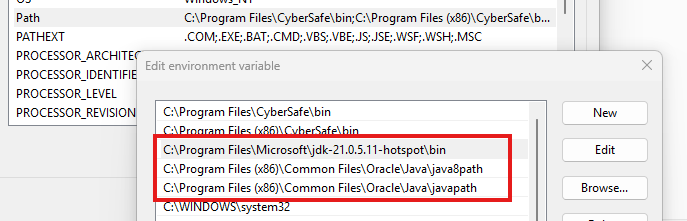

> [!Tip] OpenJDK 21.0.5.11 is 64bit and in `C:\Program Files`, while Oracle JDK 1.8.0 is 32bit, so it's in `C:\Program Files (x86)`

Further checking, found I also have one 64bit Java 1.8.0 installed in the folder `C:\Program Files\Java\jre1.8.0_431`.

Thus, below are the summary of the Java Running Environments currently:

| Version | Screen for Folder | Java version check |
| --- | --- | --- |
| Oracle Java 1.8.0_431 | 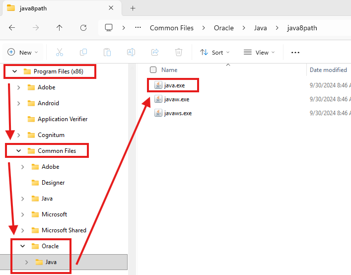 | 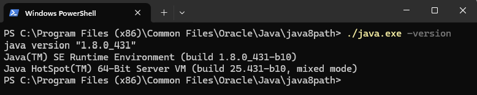 |
| Java 1.8.0_431-b10 | 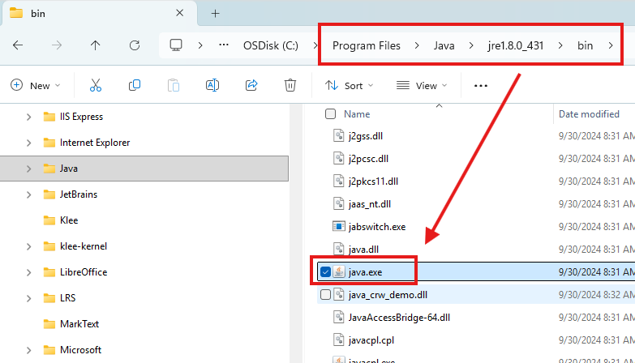 | 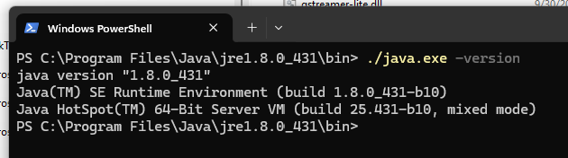 |
| OpenJDK 21.0.5 | 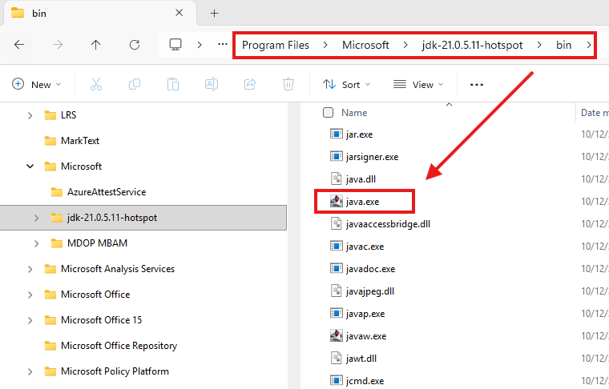 | 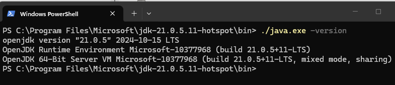 |

### Usage of Java JDK from Essential Tool

For checking `Java` used by Tomcat, go to tomcat path:

`C:\Program Files\Apache Software Foundation\Tomcat 9.0\bin`

run `tomcat9w.exe`, you may see below, switch to `Java` tab:

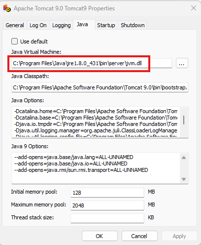

The path of JVM is `C:\Program Files\Java\jre1.8.0_431\bin\server\jvm.dll`, which is using the Oracle Java 1.8.0 64bit edition.

For checking `Java` used by Protégé, go to `Protege_3.5` installation folder:

`C:\Program Files\Protege_3.5`

open the configuration file `Protege.lax`, as below:

1[Protege3.5_jvm](img/Protege3.5_jvm.png)

The path of JVS is `C:\\Program Files\\Java\\jre1.8.0_431\\bin\\java.exe`

Thus, both Protégé and Tomcat are pointed to the 64bit Oracle JDK 1.8.0_431.

