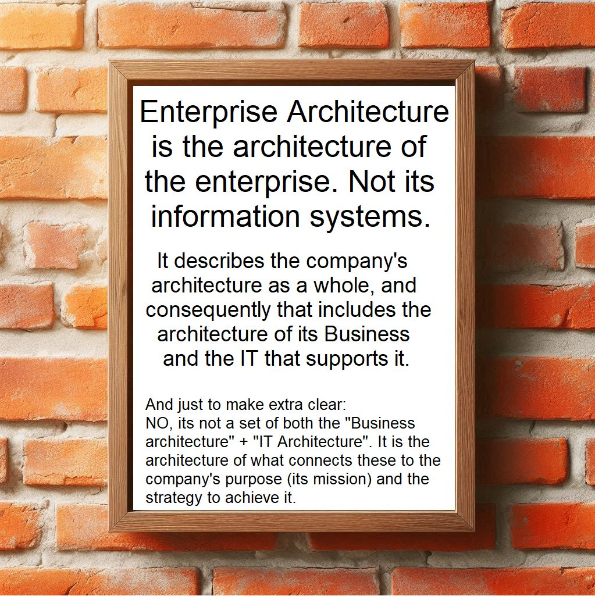

# Enterprise Architecture (EA) - Learning & Practice

- [Enterprise Architecture (EA) - Learning \& Practice](#enterprise-architecture-ea---learning--practice)
  - [Definition of Enterprise Architecture](#definition-of-enterprise-architecture)
  - [Enterprise Architecture Tool](#enterprise-architecture-tool)
  - [企业架构师的诗](#企业架构师的诗)
  - [Sonnet to the Enterprise Architect](#sonnet-to-the-enterprise-architect)

Here is the collections of Xiaoqi's view on Enterprise and Business Architecture domain knowledge.

- General Enterprise Architecture
- [Business Architecture](./architect_role/business-architecture/)
- Information Architecture
- Application Architecture
- Technology Architecture
- Integration Topic
- [Architect related readings](./archi_reading_tools/)
- [Reference Models](/ref_models/)

## Definition of Enterprise Architecture

Thanks for the nice picture from [Ronald Arsolino](https://www.linkedin.com/in/ronaldarsolino/):

## Enterprise Architecture Tool

- [Archi - ArchiMate Modeling Tool](./architool/README.md)
  - [ArchiMate Specification](/archimate/)
- [Sparx System Enterprise Architect](/Sparx)
- [Essential Project EA Tool](./Essential_EA/)

---

One interesting but relavent article here: [How Elon Musk Learns Faster Than Everyone Else](https://medium.com/@mariastepanova7/how-elon-musk-learns-faster-than-everyone-else-26c5cf4c2ef5), this can be also the disppline that one Enterprise Architect practice:

__Rule#1 -- Make sure you are building a Tree of Knowledge__

Quote from Musk: _"It is important to view knowledge as sort of a semantic tree -- make sure you understand the fundamental principles, i.e. the trunk and big branches, before you get into the leaves/details or there is nothing for them to hang onto."_

If you want to learn anything faster, you need to start with the fundamentals. Understand the core concepts first, before moving into more details.

__Rule#2 -- You can't remember what you can't connect__

In order to increase your chances of success, learn the fundamentals of the chosen fields first. Only then start expanding your knowledge.

Learn across multiple fields and work tirelessly on making connections.

---

## 企业架构师的诗

之一：

云上蓝图织万端， 
数声算法定乾坤。 
代码如诗连世界， 
架构为桥接古今。

之二：

筹谋千载绘宏图， 
笔下云涛化电途。 
不问功名留智慧， 
一城数据是江湖。

之三：

构梦蓝图连九霄， 
数流云路策中调。 
千机汇聚通天下， 
一笔勾成万象昭。

## Sonnet to the Enterprise Architect

Architect, whose mind both wide and deep, 
Doth chart the realms where systems intertwine, 
Thy vision through the tangled shadows sweep, 
And order springs where chaos once did twine.

With diagrams thou draw’st the path of might, 
Through cloud and code thy structures stand and soar, 
Each node and stream reflects thy keen insight, 
Each flow doth sing of balance evermore.

Thou art the bridge 'twixt dream and firm decree, 
A poet wrought in logic’s measured line, 
Through thee the realm of business learns to see, 
Its soul transfigured in design divine.

So may thy craft, though silent to the crowd, 
Stand tall—its beauty veiled, yet unbowed.

---

If you find the information here is interesting or useful, please consider [donate $1 dollar](https://paypal.me/zhaoxiaoqi/1) (secure Paypal link) for a coffee, thanks and enjoy!

Any questions, [reach me here](mailto:xiaoqizhao@outlook.com) please.