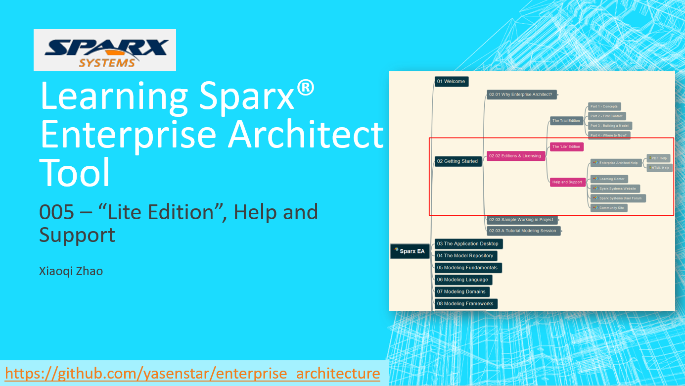

# Learning and Practice in SPARX Enterprise Architect

Learning mindmap (keep updating), you can view the [MM file](SparxEA.mm) directly using FreePlane:

Here are video lists in my YouTube Channel:

Keeping adding more...

Thanks for visiting.