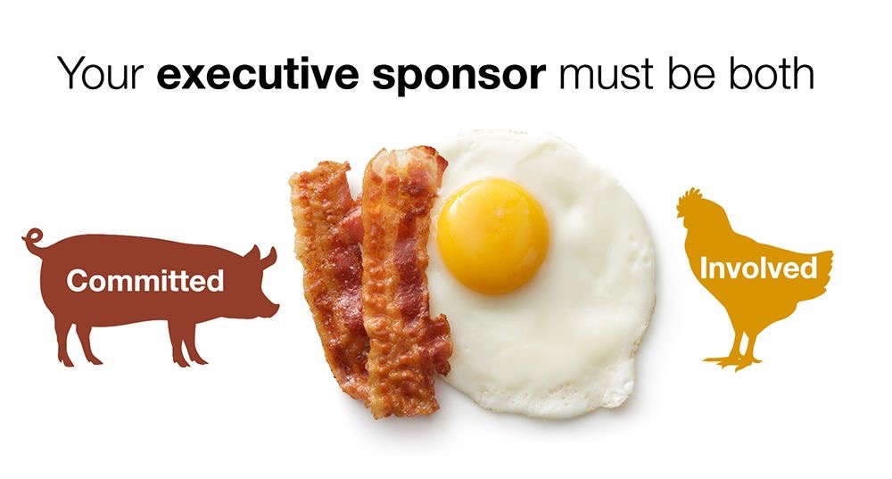

# Committed and Involved: Your executive sponsor must be both!

One of my early ‘go-to’ articles on executive sponsorship was written in 2005 by Bart Perkins at Computerworld (Link: https://lnkd.in/gQtWPGnS). The article is a little dated now, but the underlying lessons still ring true for data initiatives.

In the article, Perkins references the bacon-and-eggs breakfast joke that the chicken is involved but the pig is committed. He then highlights how a good executive sponsor needs to be both committed AND involved.

👉  If your executive sponsor is involved but not committed, all you will receive is lip service—verbal support without ever getting the necessary funding or resources.

👉  If your executive sponsor is committed but not involved, their lack of presence and advocacy in meetings, communications, and other key moments will doom your initiative too.

Securing solid executive sponsorship upfront for your initiatives is of paramount importance. Ideally, you have an executive sponsor with “skin-in-the-game” who will directly benefit from your data initiative. In addition, he or she is willing to set aside sufficient time to play an active role in its success.

You don’t want to go down a path with “a missing, weak, or superficially involved executive sponsor” as it will ultimately lead to your initiative’s failure.

*Source: LinkedIn, 2022-10-10*