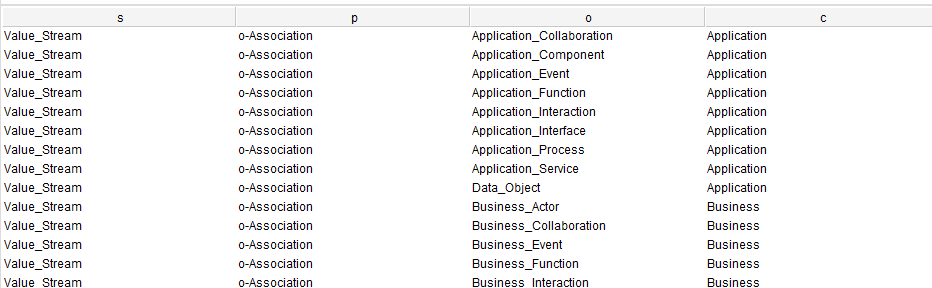

# Reference SPARQL for Archi Tool Relationship Query

## Ontology: `archimate3.2.rdf`

### Add PREFIX for Ontology

```SQL
PREFIX rdf: <http://www.w3.org/1999/02/22-rdf-syntax-ns#>
PREFIX owl: <http://www.w3.org/2002/07/owl#>
PREFIX rdfs: <http://www.w3.org/2000/01/rdf-schema#>
PREFIX xsd: <http://www.w3.org/2001/XMLSchema#>
PREFIX a: <http://www.semanticweb.org/yasen/ontologies/2024/5/archimate3.2#>
```

## Ontology: `ArchiMate_Relationships.rdf`

### Add PREFIX for Ontology

```SQL
PREFIX rdf: <http://www.w3.org/1999/02/22-rdf-syntax-ns#>
PREFIX owl: <http://www.w3.org/2002/07/owl#>
PREFIX rdfs: <http://www.w3.org/2000/01/rdf-schema#>
PREFIX xsd: <http://www.w3.org/2001/XMLSchema#>
PREFIX a: <http://www.semanticweb.org/yasen/ontologies/2024/5/ArchiMateRelationships#>
```

## Queries

Since we use `a` as PREFIX for both ontologies, below queries can be applied to both, except specifically mentioned.

### List all Relationship Sorted by Layer and Element

- ArchiMate Layer is modeled as Class.
- ArchiMate Element is modeld as Individual

Use "Value_Stream" as subject sample.

```SQL
PREFIX rdf: <http://www.w3.org/1999/02/22-rdf-syntax-ns#>
PREFIX owl: <http://www.w3.org/2002/07/owl#>
PREFIX rdfs: <http://www.w3.org/2000/01/rdf-schema#>
PREFIX xsd: <http://www.w3.org/2001/XMLSchema#>
PREFIX a: <http://www.semanticweb.org/yasen/ontologies/2024/5/ArchiMateRelationships#>
SELECT ?s ?p ?o ?c
WHERE {	
    ?s ?p ?o .
	?o rdf:type ?c .
	FILTER(
        ?s = a:Value_Stream && ?p != rdf:type && ?c != owl:NamedIndividual
    )
}
ORDER BY ?c ?o
```

Result is as below:

