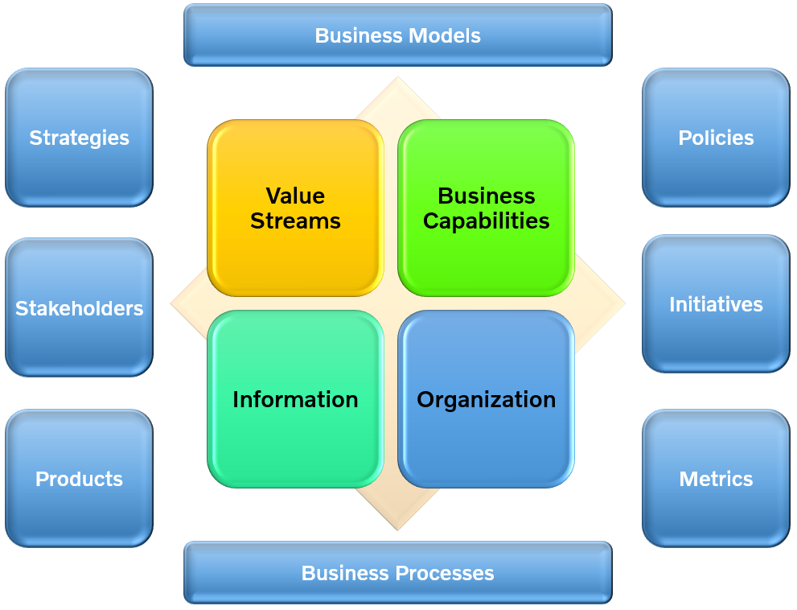

# Definition of Business Architecture

The value of Biz Arch is to provide an abstract representation of an enterprise and the business ecosystem in which it operates. By doing so, Biz Arch delivers value as an effective communication and analytical framework for translating strategy into actionable initiatives. The framework also enhances the enterprise's capacity to enact transformational change, navigate complexity, reduce risk, make more informed decisions, align diverse stakeholders to a shared vision of the future, and leverage technology more effectively.

Here are the 4 key domains, 6 surrounding domains and 2 extended domains view:

Copyright, Xiaoqi Zhao, 2022