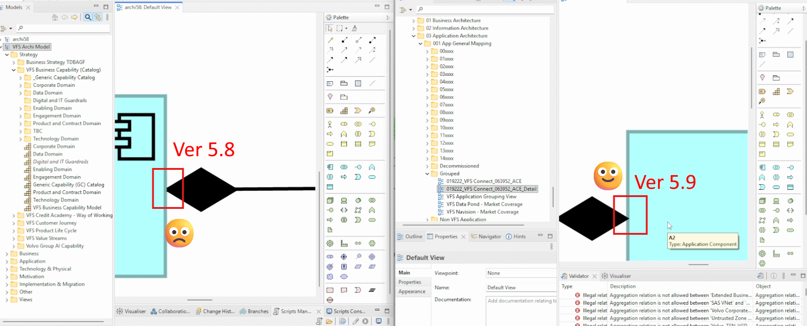

# Mastering Archi 5.9.0: The Complete Feature Deep Dive

- [Mastering Archi 5.9.0: The Complete Feature Deep Dive](#mastering-archi-590-the-complete-feature-deep-dive)
  - [1. The Headliner: Invert Connection Direction](#1-the-headliner-invert-connection-direction)
  - [2. Structural \& Model Tree Enhancements](#2-structural--model-tree-enhancements)
  - [3. Visual Precision \& Help Content](#3-visual-precision--help-content)
  - [4. Interoperability: Open Exchange Format](#4-interoperability-open-exchange-format)
- [Implementation Strategy: Running 5.8 and 5.9 in Parallel](#implementation-strategy-running-58-and-59-in-parallel)
- [Conclusion](#conclusion)

## 1. The Headliner: Invert Connection Direction

The most impactful productivity feature in this release is the ability to swap the source and target of a relationship instantly.

- **Functionality**: Right-click any relationship in a View and select "Invert Connection Direction." This applies globally to all instances of that relationship across all Views.

- **Safety Logic**: Archi maintains the integrity of the ArchiMate language. If the inverted relationship would violate specification rules (e.g., an Access relationship that isn't valid in reverse), the option will be greyed out.

- **Technical Insight**: While the unique ID of the relationship remains the same in the underlying XML, the source and target attributes are swapped.

- **Pro-Tip**: Remember that labels and documentation are not automatically updated. If a relationship is named "A depends on B," you must manually update the text to "B depends on A" after inverting.

## 2. Structural & Model Tree Enhancements

Navigating complex enterprise models becomes significantly easier with two key updates to the Model Tree.

**Advanced Alphanumeric Sorting**

Archi 5.9 introduces a "human-logical" sorting algorithm.

- **Old Behavior**: 1, 10, 2, 3

- **New Behavior**: 1, 2, 3, 10

    This is particularly useful for architects who use numbering systems to sequence capabilities or processes. This feature is optional and can be toggled in Preferences.

**Search State Retention (The "Efficiency Fix")**

One of the most requested workflow improvements is the behavior of the search filter.

- **The Change**: In version 5.9, when you clear a search filter, the Model Tree now **restores and maintains your previous selection**.

- **Impact**: You no longer lose your place in a deep folder hierarchy after performing a quick search, saving countless clicks during long modeling sessions.

## 3. Visual Precision & Help Content

Version 5.9 continues to refine the "Diagramming as Code" aesthetic by improving how connections are rendered.

- **Accurate Connection Ends**: Aggregation and Composition "diamonds" are now drawn with higher precision. In previous versions, the arrowheads could sometimes appear overlapped or "cut off" by the element box. In 5.9, they are drawn cleanly in front of the element, ensuring professional-grade exports for senior stakeholder presentations.

    

- **Help System Cleanup**: Following the Open Group's change in access policies, the ArchiMate 3.2 specification overview has been removed from the internal Help content. Users are encouraged to download the specification directly from the Open Group website.

## 4. Interoperability: Open Exchange Format

For those working in multi-tool environments, the **Open Exchange Format (XML)** now officially imports and exports **Specialization names**. This ensures that custom stereotypes or specialized elements maintain their specific identities when moving between Archi and other ArchiMate-compliant platforms.

# Implementation Strategy: Running 5.8 and 5.9 in Parallel

If you are hesitant to migrate your entire production environment immediately, you can run both versions simultaneously:

1. Download the Portable (Zip) version of Archi 5.9.

2. Extract it to a dedicated folder (e.g., `D:\Tools\Archi5.9`).

3. Modify the `Archi.ini` file to point to a unique data folder. This prevents the two versions from conflicting over the same configuration files.

4. Rename the `.exe` to `Archi59.exe` for easy identification in your Task Manager.

Here is the original `Archi.ini`

```title="Original Archi.ini"
-startup
plugins/org.eclipse.equinox.launcher_1.6.800.v20240513-1750.jar
--launcher.library
plugins/org.eclipse.equinox.launcher.win32.win32.x86_64_1.2.1000.v20240507-1834
-cleanConfig
--launcher.defaultAction
openFile
-eclipse.keyring
@user.home/AppData/Roaming/Archi/secure_storage
-vmargs
-Dosgi.requiredJavaVersion=21
-Dfile.encoding=UTF-8
-Declipse.p2.data.area=@config.dir/p2
-Ddata.location=@user.home/Documents/Archi
-Dslf4j.internal.verbosity=ERROR
--add-modules=ALL-SYSTEM
-Dosgi.instance.area=@user.home/AppData/Roaming/Archi
-Dosgi.configuration.area=@user.home/AppData/Roaming/Archi/config
-Dorg.eclipse.equinox.p2.reconciler.dropins.directory=%user.home%/AppData/Roaming/Archi/dropins
```

Using `D:\Tools\Archi5.9` as my v5.9 path sample, the modified ini file as below:

```title="Revised Archi.ini"
-startup
plugins/org.eclipse.equinox.launcher_1.6.800.v20240513-1750.jar
--launcher.library
plugins/org.eclipse.equinox.launcher.win32.win32.x86_64_1.2.1000.v20240507-1834
-cleanConfig
--launcher.defaultAction
openFile
-eclipse.keyring
d:/tools/Archi5.9/secure_storage
-vmargs
-Dosgi.requiredJavaVersion=21
-Dfile.encoding=UTF-8
-Declipse.p2.data.area=@config.dir/p2
-Ddata.location=d:/tools/Archi5.9/
-Dslf4j.internal.verbosity=ERROR
--add-modules=ALL-SYSTEM
-Dosgi.instance.area=d:/tools/Archi5.9/
-Dosgi.configuration.area=d:/tools/Archi5.9/config
-Dorg.eclipse.equinox.p2.reconciler.dropins.directory=d:/tools/Archi5.9/dropins
```

# Conclusion

Archi 5.9.0 is more than just a maintenance release; it is a refinement of the architect's daily toolkit. By automating relationship inversion and fixing long-standing tree navigation hurdles, it allows you to focus on the architecture itself rather than the mechanics of the tool.

See [Archi_5.9_FeatureIntro.pdf](./Archi_5.9_FeatureIntro.pdf) for the detail highlights.

Here you may watch [The deep dive demo video](https://youtu.be/PWGY4RqZml8) in YouTube.

Happy Modeling!

---

Last updated at 2026/04/14