# Query on Archi's HTML Exported Report

Use ArchiSurance finished model as sample, export HTML report from Archi ver5.3, the report file folder is [here](https://github.com/yasenstar/ArchiSurance_Practice/tree/main/ArchiSurance_HTML_5.3), like below file structure.

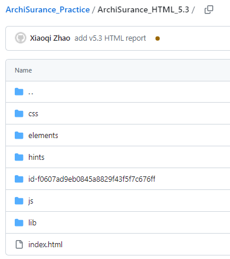

Version of plug-in: this article is based on HTML Report Plugin v2, in my Windows OS, the detail version information is shown under `plugins` folder as `com.archimatetool.reports_5.3.0.202403191218`.

Please visit [here](https://github.com/archimatetool/archi/wiki/HTML-export-v3) to learn the HTML Export tool's history (v1 to now v2) and planning for more advanced v3.

## Open the HTML Report

Several methods:

1. Once you've exported the HTML report to your local disk, you can directly double-click the index.html file to open the report in your default web browser
2. Within `Archi`, from menu, select `Tools > Preview HTML Report`
3. You can copy / publish your exported report folder to any of your web server (local or remote), then use URL of your web server to access it

The third tab is the SQL window - alasql

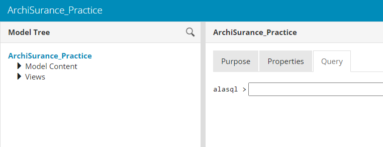

## Reference Links for Alasql

- [AlaSQL GitHub Projects](https://github.com/AlaSQL)
- [The AlaSQL Wiki in GitHub](https://github.com/AlaSQL/alasql/wiki)
- [alasql wiki site](https://alasql-wiki.readthedocs.io/en/latest/readme.html)
- [SQL Queries in the HTML Report in Archi GitHub](https://github.com/archimatetool/archi/wiki/SQL-queries-in-the-HTML-report)
  - [A nice article: Analysis of Archimate models using SQL queries](https://fightingcomputers.nl/Guides/Analysis-of-Archimate-model-using-SQL-queries)

## Show TABLES of the HTML Report

You may imagine there's relational database structure of the HTML report, so let's use the first query statement to list the tables:

```sql
SHOW TABLES
```

You show see below list result:

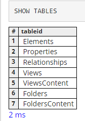

## Understand the Data Model

Here is the table relationships (built by RISE EDITOR):

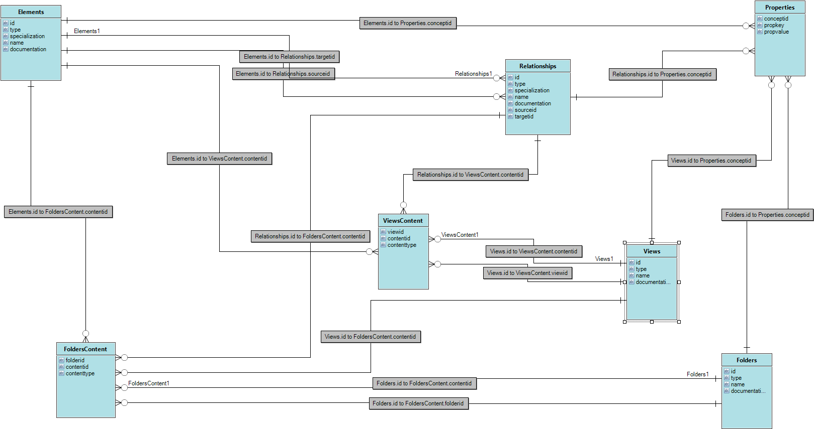

---

## Basic Query - Show Table Contents

Let's use `TOP x` to limit the numbers of return items.

### Table: Elements

To see first 10 rows of columns (fields) in the `Elements` table you may enter:

```sql
SELECT TOP 10 * FROM Elements
```

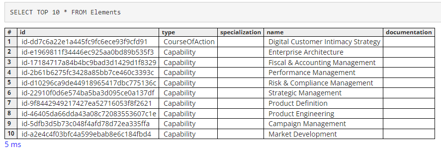

Below are the TOP 5 reference for all other tables:

### Table: Relationships

```sql
SELECT TOP 5 * FROM Relationships
```

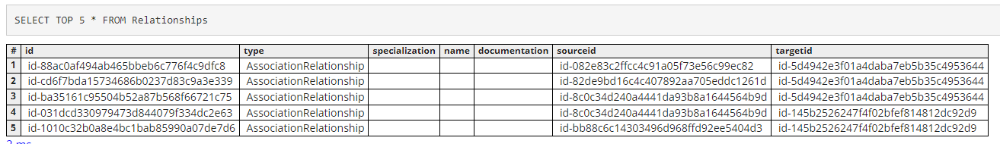

### Table: Properties

```sql
SELECT TOP 5 * FROM Properties
```

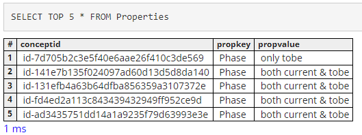

### Table: Views

```sql
SELECT TOP 5 * FROM Views
```

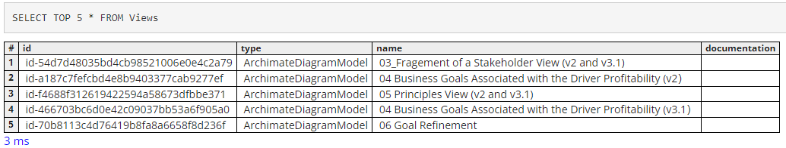

### Table: ViewsContent

```sql
SELECT TOP 5 * FROM ViewsContent
```

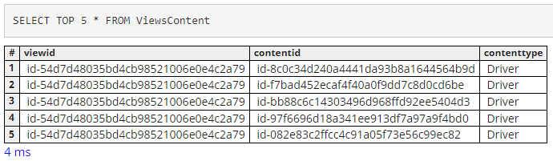

### Table: Folders

```sql
SELECT TOP 5 * FROM Folders
```

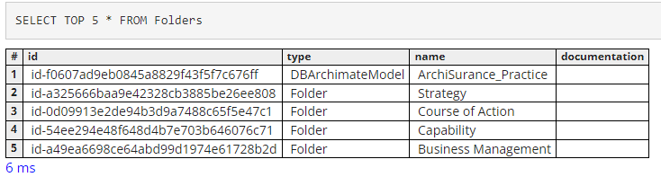

### Table: FoldersContent

```sql
SELECT TOP 5 * FROM FoldersContent
```

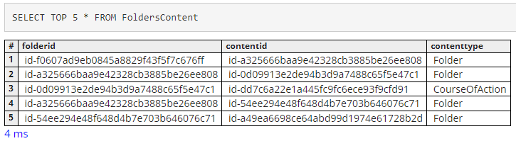

---

## More Query Practices

Here I'm listing several sample from variable use cases, it may not cover all but intend to show you the approach of making more complex and specific querying.

### List Specific Type of Elements

Use case: show all `capability`

```sql
SELECT TOP 10 * FROM Elements As e WHERE e.type = 'Capability'
```

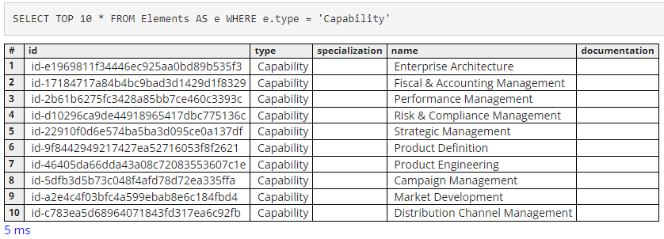

Please be noted that it's case sensitive within SQL statements, so if you put `'capability'`, you will get empty result.

In order to key in the correct wording, it would be useful that you gradually summarize certain "dictionary" for your self using, e.g. all of the `Elements.type`, let's use below query to get that list in unique value:

```sql
SELECT DISTINCT Elements.type FROM Elements;
```

Then you can have below 38 Element Types as one list:

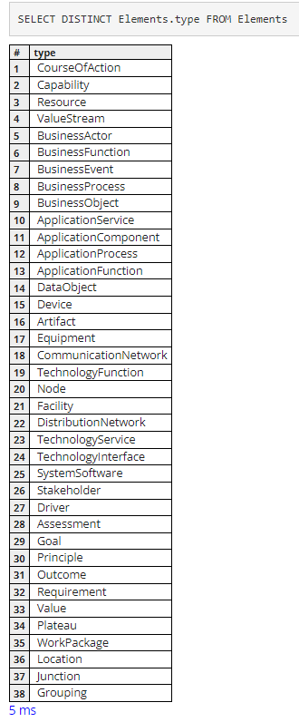

### List Sepcific Properties with their Value

First, as we learnt just now, let's get the full list of the Properties (name) in your model, so that you can use them for querying:

```sql
SELECT DISTINCT Properties.propkey FROM Properties
```

Luckily, our `ArchiSurance` model doesn't have too many Properties, like below result:

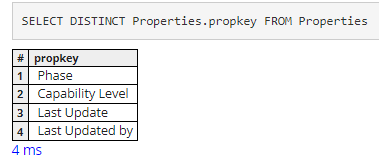

Then, let's try to query the value of Property with key as `Phase`, and hope the results are in unique value

```sql
SELECT DISTINCT propkey, propvalue FROM Properties WHERE propkey = 'Phase'
```

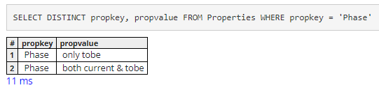

If you don't point out `DISTINCT`, below will be the result as reference:

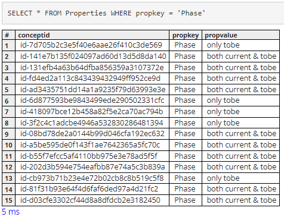

Using this way, you can query any values from those 7 tables.

### List All Types of Relationship Used in the Model

```sql
SELECT DISTINCT Relationships.type FROM Relationships
```

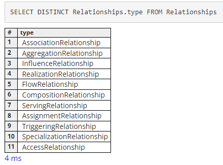

---

## Query from Combined Tables

Now let's move to next level, the actual power of learn from your Archi model is to general insights from multiple tables instead of single plain table, let's practice the `JOIN` clause

### List Some Elements with their Properties

In ArchiSurance model, we created two Properties - "Capability Level" & "Phase" - for some Business Capabilties, let's query those Capabilities together with those Properties Key and Value, as below:

```sql
SELECT e.name, p.propkey, p.propvalue
FROM Elements e JOIN Properties p
ON e.id = p.conceptid
WHERE e.type = 'Capability'
```

You may aware, alasql automatically add `INNER` before `JOIN`, for Archi model, it's same as direct `JOIN` without `INNER`. However, if you use `OUTER JOIN` you will get wrong (incorrect) results.

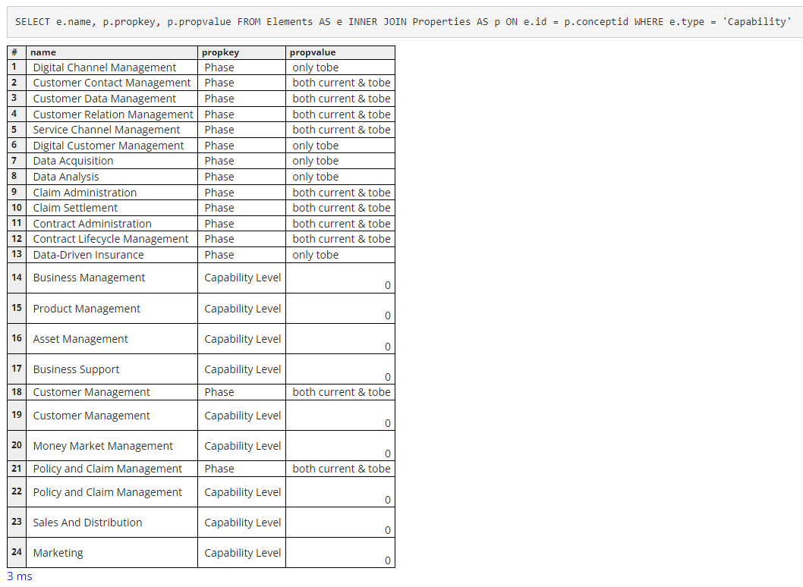

### List Application Coorperation Relationships

In ArchiSurance Figure-22, we modeled the application to application relationship with Flow-Relation notation, let's write a query to list those.

```sql
SELECT r.sourceid, e1.name AS sourceName, r.type, r.targetid, e2.name AS targetName
FROM Relationships r
INNER JOIN Elements e1 ON r.sourceid = e1.id
INNER JOIN Elements e2 ON r.targetid = e2.id
WHERE
    r.type = 'FlowRelationship' AND
    e1.type = 'ApplicationComponent' AND
    e2.type = 'ApplicationComponent'
```

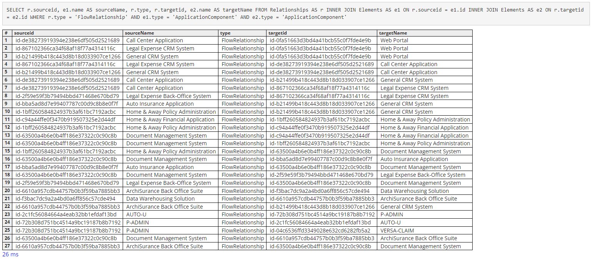

### If you want to see the name of Relationships, use below updated query:

```sql
SELECT r.sourceid, e1.name AS sourceName, r.type, r.name AS relationName, r.targetid, e2.name AS targetName
FROM Relationships AS r
INNER JOIN Elements AS e1 ON r.sourceid = e1.id
INNER JOIN Elements AS e2 ON r.targetid = e2.id
WHERE r.type = 'FlowRelationship' AND e1.type = 'ApplicationComponent' AND e2.type = 'ApplicationComponent'
```

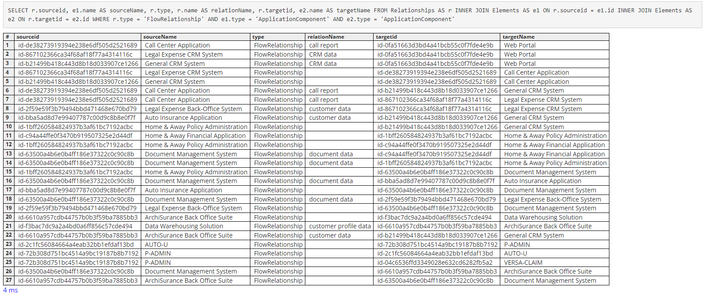

---

```sql
SELECT r.sourceid, e1.name AS sourceName, r.type, r.name AS relationName, r.targetid, e2.name AS targetName FROM Relationships AS r INNER JOIN Elements AS e1 ON r.sourceid = e1.id INNER JOIN Elements AS e2 ON r.targetid = e2.id WHERE r.type = 'ServingRelationship' AND e1.type = 'ApplicationComponent' AND e2.type = 'Location' AND e2.name LIKE '%Market%'
```

### List of Application x Market Mapping

```sql
SELECT r.sourceid, e1.name AS sourceName, r.type, r.name AS relationName, r.targetid, e2.name AS targetName
FROM Relationships AS r
INNER JOIN Elements AS e1 ON r.sourceid = e1.id
INNER JOIN Elements AS e2 ON r.targetid = e2.id
WHERE r.type = 'ServingRelationship' AND e1.type = 'ApplicationComponent' AND e2.type = 'Location' AND e2.name like '%Market %'
```

#### Query Specific Application's Market Coverage

```sql
SELECT e1.name AS sourceName, r.type, r.name AS relationName, e2.name AS targetName
FROM Relationships AS r
INNER JOIN Elements AS e1 ON r.sourceid = e1.id
INNER JOIN Elements AS e2 ON r.targetid = e2.id
WHERE r.type = 'ServingRelationship' AND
      e1.type = 'ApplicationComponent' AND
      e2.type = 'Location' AND
      e2.name LIKE '%Market %' AND
      e1.name LIKE '%ID%' -- can be partial in the name of catalog of application component
```

#### For decommisssioned applications, query their effective from and end date to specific market coverage

```sql
SELECT e1.name AS sourceName, r.type, e2.name AS targetName, p.propkey, p.propvalue
FROM Relationships AS r
INNER JOIN Elements AS e1 ON r.sourceid = e1.id
INNER JOIN Elements AS e2 ON r.targetid = e2.id
INNER JOIN Properties AS p ON r.id = p.conceptid
WHERE r.type = 'AssociationRelationship' AND
      e1.type = 'ApplicationComponent' AND
      e2.type = 'Location' AND
      e2.name LIKE '%Market %' AND
      p.propkey LIKE '%Effective%'
```

## How to Export Data to file (e.g. csv)

Use below syntax:

```sql
SELECT * INTO CSV("filename.csv") FROM TableName;
```

In Windows, the CSV file will be by default generated in your `Downloads` folder.

Noted that you can execute multiple SQL statements with separating every statement by `;`, using below statement you can export all of the 7 tables of Archi HTML Report model into 7 CSV files:

```sql
SELECT * INTO CSV("Elements.csv") FROM Elements;
SELECT * INTO CSV("Properties.csv") FROM Properties;
SELECT * INTO CSV("Relationships.csv") FROM Relationships;
SELECT * INTO CSV("Views.csv") FROM Views;
SELECT * INTO CSV("ViewsContent.csv") FROM ViewsContent;
SELECT * INTO CSV("Folders.csv") FROM Folders;
SELECT * INTO CSV("FoldersContent.csv") FROM FoldersContent;
```

### List specific property (application with APM ID propkey) and export to csv

```sql
SELECT e.name, p.propkey, p.propvalue
FROM Elements AS e INNER JOIN Properties AS p ON e.id = p.conceptid
WHERE e.type = 'ApplicationComponent' AND p.propkey = 'APM ID'
ORDER BY e.name ASC
```

---

## Add-ons - Use `COUNT` to Check Scale of Your Model

### Count Numbers of Items per Table

```sql
SELECT COUNT(*) FROM Elements
```

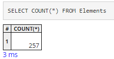

```sql
SELECT COUNT(*) FROM Properties
```

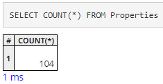

```sql
SELECT COUNT(*) FROM Relationships
```

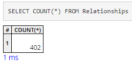

### Count Numbers of Items per Certain Column with `GROUP BY`

```sql
SELECT Relationships.type, COUNT(*) FROM Relationships GROUP BY Relationships.type
```

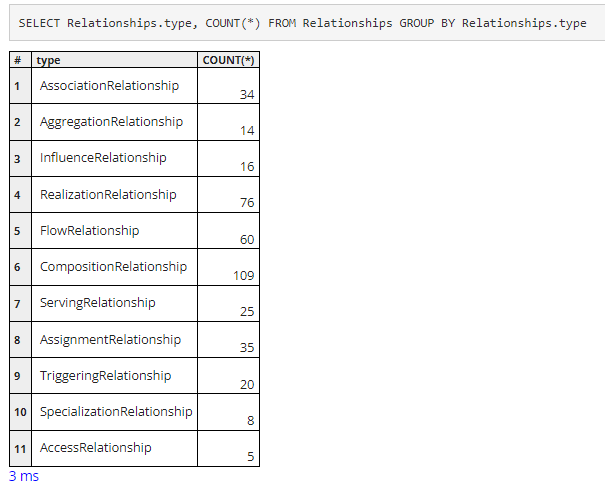

---

## Add-ons - Tip: How to Clear the alasql Query Console Screen

When you open the exported Archi HTML report, you can use the 3rd tab - Query - to retrieve needed data in alasql syntax from the Archi model in broswer, like below:

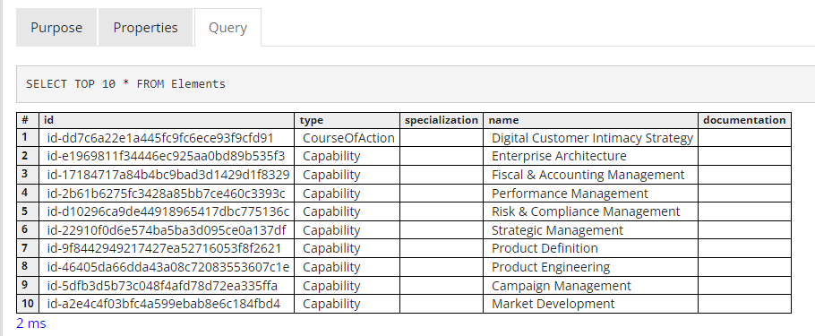

This is convenient if you want to have a list of items from Archi model for other analysis purpose, however, once you've exectued several queries, the console screen is getting busy and you have to scroll up/down to keep querying, so, how can I clear the screen and make the new query?

Unfortunately, the commands, like "clear screen;" / "cl scr;" in Oracle SQL, or "cls" in MySQL Windows, or "clear" in MySQL Linux, etc.. are not able to have effective in this JavaScript based SQL engine - alasql, this How-To intends to introduce two workarounds as tips for you to achieve this objective.

### Workaround 1 - Refresh Screen through Switching to Model

Using ArchiSurance model as sample, when you have several queries on the screen and want to clear the console, as below, simply click the Model name in the upper left, below the "Model Tree" text:

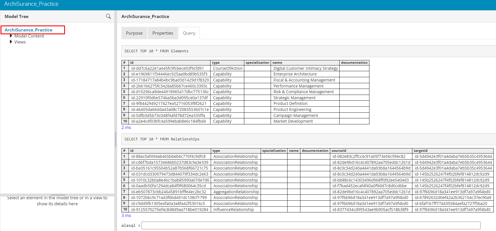

Doing this, the right panel will be restored to the initialization state, the default tab - the first one "Purpose" - will be selected:

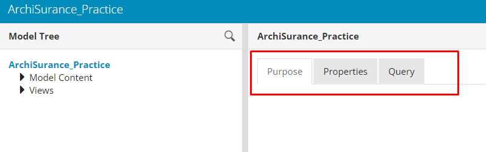

Now, when you click the "Query" tab, it's showing the new Query prompt and you can start from clear screen:

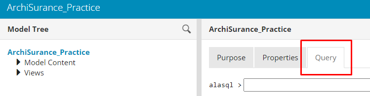

This workaround doesn't need any configuration change, however, you have to do those several clicks.

### Workaround 2 - "Hacking" a little to Add Real "Clear" Button

Thanks for [Phil Beauvoir](https://forum.archimatetool.com/index.php?action=profile;u=1) giving quick insight, see the link in Archi Forum: https://forum.archimatetool.com/index.php?topic=1525.msg7848 for discussion.

If you're interested to do some coding, here is the way that you can modify the "HTML Reporting" plug-in to add one "Clear" button, so it will be shown on any of your new generated HTML reports in more convenient way.

Assume you're using Archi ver5.3 in Windows OS, within your Archi program file folder, find out the "HTML Report" plugin in the subfolder, we will need to position the "frame.stg" file as below:

```powershell
C:\Program Files\Archi\plugins\com.archimatetool.reports_5.3.0.202403191218\templates\st\frame.stg
```

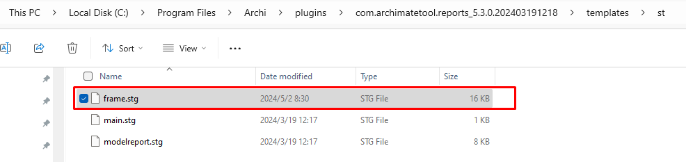

Open this file in any code / text editor, ensure you have Administrator right, in line 337 add below line:

```javascript
<button onclick="$('#myconsole').html('');">Clear</button>
```

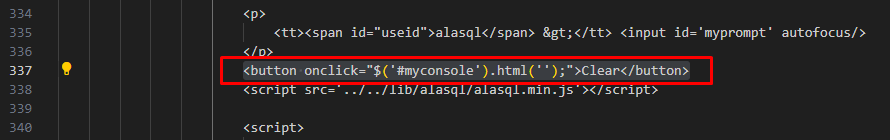

After that, save the file.

Re-generate one new HTML report for your Archi model, when you open the report in web browser, you can see the "Clear" button is under your alasql query prompt:

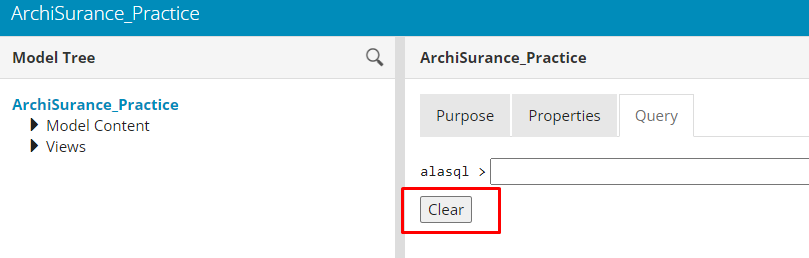

At any time, you can simply click this "Clear" button to make console screen clear, without need to switch outside the Query window.

---

## Demo Video

[Here](https://youtu.be/cYuASoWtFPY) I've recorded one step-by-step demo videos go through above contents, feel free to watch.

---

## Summary

This article only list limited query use cases, however, I hope from basic to combined query demo, you are now familiar of the table structures of Archi's HTML exported report, and from those samples, you can write your query to fit in your own data scenario.

Welcome to hear any of your comments.

Author: Xiaoqi Zhao, Date: May 1st, 2024 @Montreal