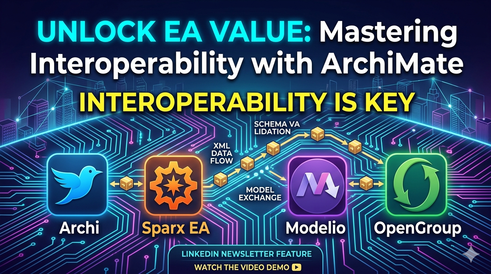

# Bridging the Gap: Mastering Interoperability with the ArchiMate® Open Exchange File Format

- [Bridging the Gap: Mastering Interoperability with the ArchiMate® Open Exchange File Format](#bridging-the-gap-mastering-interoperability-with-the-archimate-open-exchange-file-format)
  - [What is the Open Exchange File Format?](#what-is-the-open-exchange-file-format)
  - [Step-by-Step: Moving Models Across Tools](#step-by-step-moving-models-across-tools)
  - [Why This Matters for "Everyone Architecture"](#why-this-matters-for-everyone-architecture)
  - [My Recommendations for Architects](#my-recommendations-for-architects)
  - [Furthermore...](#furthermore)
    - [Watch the Full Demo:](#watch-the-full-demo)
    - [Let’s Discuss:](#lets-discuss)

As Enterprise Architects, we often find ourselves working in a heterogeneous environment. One team might prefer the lightweight agility of **Archi**, while another department relies on the comprehensive features of **Sparx Enterprise Architect** or the open-source capabilities of Modelio.

A common challenge arises: How do we share complex architectural models across these different platforms without losing the integrity of our relationships, metadata, or diagrams?

The answer lies in the **ArchiMate® Model Exchange File Format**. In my latest deep-dive session, I demonstrated how this XML-based standard acts as the "universal translator" for EA modeling.

## What is the Open Exchange File Format?

Published by **The Open Group**, the Open Exchange File Format (specifically technical standard C19C) is designed to facilitate the exchange of ArchiMate models between different software tools. Unlike a standard CSV or Excel export—which typically only captures elements and properties—the Open Exchange format preserves:

- **The Meta-Model Structure**: Relationships (Realization, Serving, Flow, etc.) remain intact.
- **Metadata**: Subject, description, versioning, and dates.
- **Views & Diagrams**: It includes the visual layout data, allowing other tools to rebuild your diagrams.

## Step-by-Step: Moving Models Across Tools

In my recent demonstration, I showcased a round-trip workflow involving three distinct tools. Here is the breakdown of that process:

1. Exporting from Archi

Archi provides a robust implementation of the exchange format. When exporting, you can include the XSD schema and validate the model immediately.

- **Key Tip**: Ensure you fill out the metadata fields (Subject, Author, Date) during the export wizard. This ensures your model carries its context into the next tool.

2. Importing into Modelio

Modelio is an excellent open-source alternative. By using the ArchiMate import module, you can bring in the XML file generated by Archi.

- **Observation**: While the elements and relationships migrate perfectly, different tools may interpret visual styles (like icons or specific element shapes) slightly differently. However, the underlying logic of the architecture remains rock-solid.

3. Round-tripping with Sparx Enterprise Architect

Commercial tools like Sparx EA also support the standard.

- The Workflow: I imported the Archi-generated model into a Sparx EA package, modified an element (renaming a business process), and added a new "Flow" relationship.
- Closing the Loop: I then exported this modified model back into the Open Exchange format and re-imported it into Archi. The result? Archi successfully recognized the new process name and the updated diagram layout.

## Why This Matters for "Everyone Architecture"

Interoperability is a cornerstone of the **"Everyone Architecture" ** movement. When we aren't locked into a single vendor's proprietary format, we empower teams to use the tools that best fit their specific needs—whether that's a code-centric approach, a specialized open-source tool, or a heavyweight commercial suite.

## My Recommendations for Architects

1. **Read the Spec**: I highly recommend downloading the **C19C document** from The Open Group. It provides deep insights into how the XML and XSD schemas are structured.

2. **Standardize Your Metadata**: Consistent use of the metadata fields during export makes model management much easier when working in large, distributed teams.

3. **Test the "Round-Trip"**: Before committing to a multi-tool strategy, perform a small-scale test like the one in my video to understand how your specific tools handle visual layouts.

---

## Furthermore...

### Watch the Full Demo:

If you want to see the step-by-step technical execution of this process, including the XML structure and the specific import/export settings for each tool, check out my video here: https://youtu.be/FdcN3qAC2hk

### Let’s Discuss:

Does your organization use a single EA tool, or are you managing a multi-tool environment? How has model exchange impacted your workflow? Share your thoughts in the comments!

#EnterpriseArchitecture #ArchiMate #Archi #SparxEA #Modelio #DigitalTransformation #ITStrategy #Interoperability