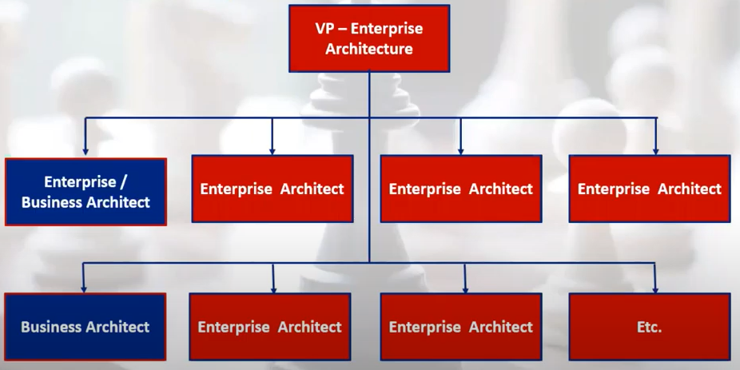

# 7 Tips to Improve Business Architecture Practice

By Daniel Lambert \(IRIS\), [link](https://youtu.be/NPG_0zQLRPk)

## 1. How to Find a Top Management Sponsor?

* Craft a Good Elevator Pitch
* Dare Talk about Money

What's the Good Sponsor?

* Ideally, it's the COO of your organization or one of its business unit \(need to be driven top-down\)
* A CIO can do if the person is business strategic oriented
* A good sponsor will help you open doors within the organization
* A good sponsor will follow-up with you at regular intervals
* A good sponsor will expect results rapidly.

Components of a Good Elevator Pitich:

1. Find a problem that's nagging your sponsor
   * Examples:
     * Projects are always delivered late
     * Delivered projects are not strategic enough
     * Our competitors have a better product offering
     * Promised synergies of an acquisition are not happening
   * Odds are high that you'll find a pertinent project in the organization annual report
2. Describe what you can do
   * Do not talk about capabilities, value streams, applications and stakeholders
   * Focus instead on the following:
     * Increasing Business Strategy Execution
     * Fixing Priorities
     * Eliminating Silos
     * Simplifying Complexity
     * Lowering Risk in the Delivery of Projects
     * etc.
3. Outline how much your practice would cost
   * Provide a number that you can beat
   * Do not hire too many architects at once
   * Do not talk about details \(but be prepared\)
4. Elaborate on what you'll generate or save
   * Outline briefly how much the tackled problem or initiative will generate or save
   * Do not talk about details \(but be prepared\)
   * Make sure that this number is much higher than the cost to implement your practice

## 2. How to Build Your Team?

### Quality 1: Customer Driven

### Quality 2: Excel at Finding Value

### Quality 3: Good Communications

### Quality 4: Not an Enterprise & Business Architecture Model Freak

### Quality 5: Know Measurement Techniques Inside Out

### Quality 6: Meeting the Organization's Objectives

### Quality 7: Involved in Delivery

Other Sourcing Considerations:

* Diversity is always preferable to homogeneity
* Hiring one from each sourcing option initiatlly will increase your odds of being successful
* Experienced enterprise architects, business strategists, business analysts can make very good business architects

## 3. How to Get Buy-In from you EcoSystem?

Why will Colloabrator Assist You?

1. You are sponsored by someone important and respected within your organization
2. They will have access to the work you are doing \(initiatives, scenarios, costing, data, etc.\)
3. They will want to be part of your success
4. Ultimately, your efforts will improve their work

### Step 1 - Business Design & Strategy

### Step 2 - Architecting Transformation

### Step 3 - Initiative Planning

### Step 4 - Agile Delivery & Execution

### Step 5 - Success Measurement

## 4. How to Integrate Business Architecture withing your Current Enterprise Architecture?

### Business Architecture Under Enterprise Architecture:

1. Business Architects report to the Enterprise Architecture leader \(most likely within IT\) along with the IT Architects that often will have an Enterprise Architect title.
2. Benefit: creates a shared vision, consistent practices and integrated architecture among business and IT architects
3. Inconvenience: business architects may be perceived as separate from the business units supported and as an IT perspective only

### Business Architecture Under the CIO

1. Business Architects report to a leader\(s\) within IT \(outside Enterprise Architecture\).
2. Benefit: creates a shared vision, consistent practices and integrated architecture among business and IT architectus
3. Inconvenients:
   * Business architects may be perceived as separate from the IT architecture disciplines
   * May lead to inconsistent practices or lack of integration between business and IT architecture

### Business Architecture within Governance

1. Business Architects are staff as part of the governance group.
2. Benefit: should create a shared vision, consistent practices and integrated architecture among business architects
3. Inconvenience: it becomes difficult business architects to be involved in the planning of IT delivery of initiatives and projects

### Business Architecture Under the COO

1. Business Architects report to a leader\(s\) within within the business.
2. Benefit: creates a tighter integration with and acceptance by business
3. Inconvenients:
   * Business architects may be perceived as separate from the IT architecture disciplines
   * May lead to inconsistent practices or lack of integration between business and IT architecture

### Centralized or Decentralized Team?

<table>
  <thead>
    <tr>
      <th style="text-align:left">Team</th>
      <th style="text-align:left">Description</th>
      <th style="text-align:left">Benefits</th>
      <th style="text-align:left">Inconveniences</th>
    </tr>
  </thead>
  <tbody>
    <tr>
      <td style="text-align:left">Centralized Team</td>
      <td style="text-align:left">All business architects report to one leader</td>
      <td style="text-align:left">
        <ul>
          <li>Creates consistent practices and integrated architecture</li>
          <li>Simpler to mange</li>
        </ul>
      </td>
      <td style="text-align:left">
        <ul>
          <li>May be perceived as separate from the business units supported</li>
        </ul>
      </td>
    </tr>
    <tr>
      <td style="text-align:left">Decentralized Team</td>
      <td style="text-align:left">All business architects report to separate leaders located in different
        business units</td>
      <td style="text-align:left">
        <ul>
          <li>Creates tighter stakeholder integration and acceptance</li>
        </ul>
      </td>
      <td style="text-align:left">
        <ul>
          <li>May lead to lack of integrated architecture</li>
          <li>May dilute role with additional responsibilities</li>
          <li>More complex structure to manage</li>
        </ul>
      </td>
    </tr>
    <tr>
      <td style="text-align:left">Hybrid Team</td>
      <td style="text-align:left">Some business architects report centrally for horizontal domains and some
        report to vertical domains in different business units</td>
      <td style="text-align:left">
        <ul>
          <li>Creates consistent practices and integrated architecture</li>
          <li>Creates tighter stakeholder integration and acceptance</li>
        </ul>
      </td>
      <td style="text-align:left">
        <ul>
          <li>More comlex structure to manage</li>
        </ul>
      </td>
    </tr>
  </tbody>
</table>

### Strategic Business Transformation Governance Committee

Ideally, EA should be part of this committee.

## 5. How to Schedule and Deliver your Roadmap to your First Success?

### Business Architecture Implementation Schedule

* Try to get positive results within 3 to 6 months
* Focus on low performing and high priority business capabilities first
* Assist in the planning of agile project deliveries

## 6. How to Calculate your Return-on-Investment after the Completion of your First Mandate, and Finally?

## 7. How to Grow and have a Greater Impact on your Organization?

