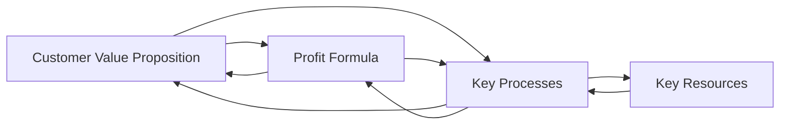

# Business Model vs Business Architecture

Shared by Zaher (Zac) Alhaj, 2022-10-07

__Business Models__ provide a high-level visual representation of the current-state and/or future-state design of a business. They describe the rationale for how an organization creates, captures, and delivers value to its various internal and external stakeholders.

Business Models also provide a basis for establishing a common understanding of how to describe and manipulate the business in pursuit of new strategic alternatives. In that sense, business models are a starting point for discussions arround business innovation and strategy planning for the allocation fo resources.

While the business model creates alignment for achiving Business Strategy, it is the Business Architecture that articulates the different perspectives and impacts of the business model.

Business Architecture breaks the business model down into the core functional elements that describe hwo the business works, including the Business Capabilities, Value Streams, Organizational Structures and Information Objects required to deliver the desired business result. Thsi process can also identify gaps and conflicts in the thinking and assumptions used to create the business model. In doing so, it can loop the discussion back to any required changes or improvements to the business model.

TOGAF publish the [Business Models](https://pubs.opengroup.org/togaf-standard/business-architecture/business-models.html) as reference.

Business Model artifacts are used to:

- Provide a common understanding of what the organization is, or looks like, today
- Portray what it intends to become in the future
- Create a critical link between the business strategy and the required blueprints of the Enterprise Architecture that define what the business needs to transform to, along with the plans that describe how to do it

Key compoonents in one Business Model Canvas:

1. Key Partnerships
2. Key Activities
3. Key Resources
4. Value Propositions
5. Customer Relationships
6. Channels
7. Customer Segments
8. Cost Structures
9. Revenue Streams

