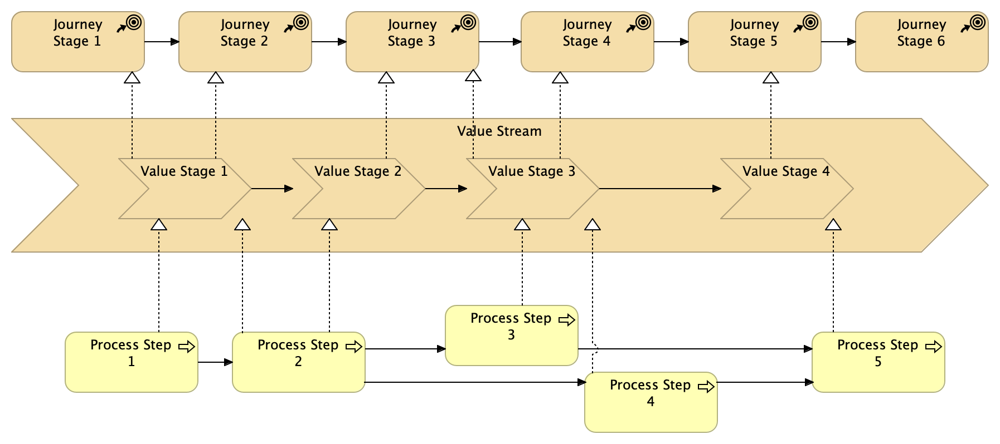

# Differences between Journeys, Values Streams and Processes

_Source: Strategy to Reality, by Whynde Kuehn_

On the surface, cusotmer journeys, values streams, and processes may all seem like the same flows, but they differ in **why they are created, when they are created, who creates them, and how they are created**. Each represetnation is _fit for purpose_, so it is important to understand their intertions, where they apply within an enterprise context, and how they fit together.

| Customer Journeys | Value Streams | Business Processes |
| --- | --- | --- |
| design, deliver, and improve the experiences that customers (or partners or employees) have as they interact with the organization. | are a core domain within the reusable business architecture knowledgebase and together with capabilities, they translate business strategies and customer journeys into the changes necessary to the business and IT environment, and they help to package those changes into a coordinated set of initiatives for execution. The actual changes are made to the operating model, including people, process, and technology during initiatives. | are not only used to carry out the detailed changes resulting from strategies and other change initiatives, but also promote continuous improvement to increase the efficiency of the internal operating environment. |

Roles:

- Customer experience designers create customer journeys.
- Business architects create value streams.
- Process professionals (and/or business analysts within an initiative context) create business processes.

Customer journeys, value streams, and processes together form a cohesive chain from the outside-in to the inside-out, and form high-level to detail. **Value streams are the keystone between customer journeys and processes**.

Value stream stages cross-map to customer journey stages and processes (ideally at the activity level) cross-map to value stream stages.

Cross Mapping: Customer Journey - Value Stream - Business Process, as below, this is the mapping described in the book.

In our actual practise, we built Capability Model first, and already has certain Capability-Process mapping, while Process is mapping with Business Actors, so it would be more feasible that putting Capability between Value Streams and Processes, adding Actors context, hence, as below little more complicated mapping:

_Date: 2022-10-04 @Montreal_